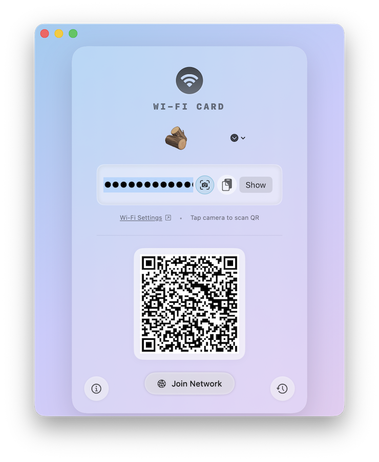

# WifiCard 📶

**WifiCard** is a simple, elegant macOS application that allows you to share your Wi-Fi connection instantly via a QR code.

  

## Download

[**Download WifiCard.zip**](https://github.com/dparksports/wificard-dist/raw/main/WifiCard.zip)

## Use Cases

### Share your wifi password
Instantly generate a QR code for your current network. Guests can scan it to join without typing complex passwords.

### Scan a Wifi credential
Use the built-in camera scanner to read Wi-Fi QR codes from other devices or printed cards.

### Join Network
One-click join for scanned networks. No need to copy-paste passwords into system settings.

### Retrieve any previously joined wifi
Access your history of scanned and generated networks to easily reconnect or share credentials again.

## Features

-   **Instant QR Generation**: Automatically generates a QR code for your current Wi-Fi network.
-   **Native macOS Design**: Built with SwiftUI, featuring a modern, glassmorphic interface that feels right at home on macOS.
-   **Privacy Focused**: Your Wi-Fi credentials stay on your device. The QR code is generated locally.
-   **Print Ready**: Easily export or print the QR code for guests.

## Installation

1.  Download the latest `WifiCard.zip` from the link above.
2.  Unzip the file.
3.  Drag `WifiCard.app` to your `Applications` folder.
4.  Double-click to launch!

## Requirements

-   macOS 12.0 (Monterey) or later.

---
*Built with ❤️ by MagicPoint*
