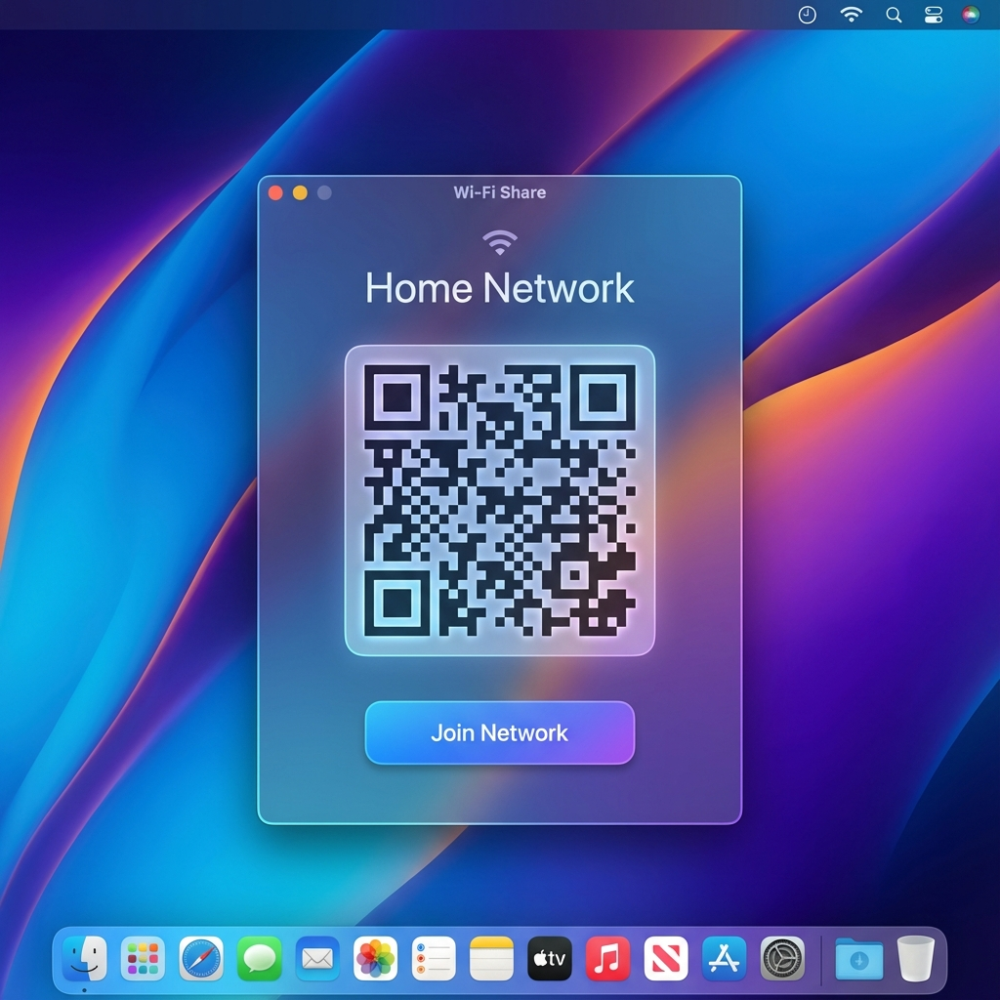

# WifiCard 📶

**WifiCard** allows you to share your Wi-Fi connection instantly via a QR code.

<p align="center">
  
</p>

## Download

[**Download WifiCard.dmg**](https://github.com/dparksports/wifi-card/releases/download/v1.9/WifiCard.dmg)

### Integrity
**SHA-256 Checksum:**
`e9fa277b670432a2559a454b4dd10ddf9a9df54c22172575382ed456d7fe7093`

**Verify in Terminal:**
```bash
shasum -a 256 WifiCard.dmg
```

## Features

-    Share your wifi password
-    Scan a Wifi credential
-    Join Network
-    Retrieve any previously joined wifi

## Installation

1.  Download the latest `WifiCard.dmg` from the link above.
2.  Open the file.
3.  Drag `WifiCard.app` to your `Applications` folder.
4.  Double-click to launch!

## Requirements

-   macOS 12.0 (Monterey) or later.

---
*Built with ❤️ by Dan Park*
